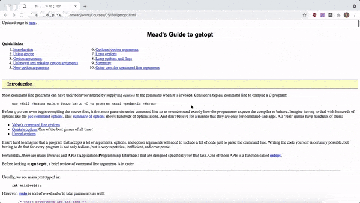

# squish-it
For all my `80x24`ers. This literally does nothing but set the width of a webpage to 50% when you click the extension icon lmao, but it's so useful:

## INSTALL

1. Clone this repository to your computer
2. Navigate to chrome://extensions/
3. Enable developer mode
4. Click "Load unpacked"
5. Select this directory in the menu that pops up
6. Squish stuff
